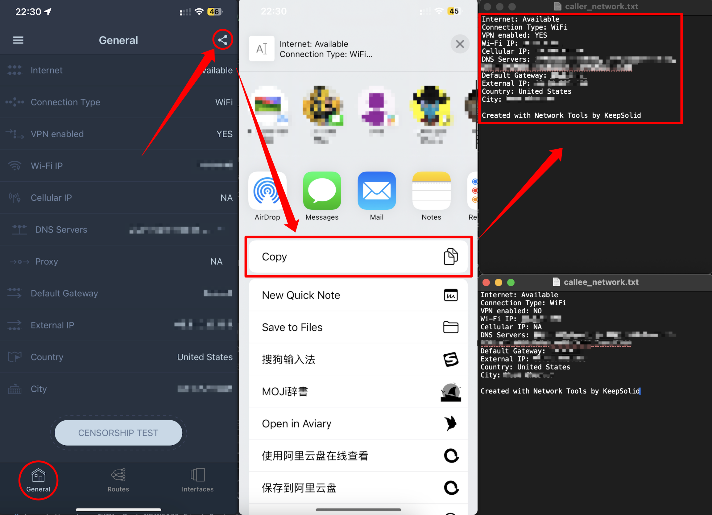

# How to perform 1:1 RTC test?

One-on-One (1:1) Real-Time Communication (RTC) test aims to sysmatically collect data during a RTC call between two clients (e.g. voice call or video call) in order to assist RTC application analysis. A typical test involves collection of client and network environment information, application packets during the call, and user behavior timestamps. Here is a breakdown of the test:

1. Preparation: how to setup network, client, and device environment to collect data?
2. Data collection: how to use the code provided to collect data?
3. Post-Processing: how to prepare the collected data for further analysis?

## Preparation

We have two configurations of the test. One is under the same environment, meaning all clients and devices are in the same room for testing (Single Room Test). And, another is under different environment, meaning each client holds his/her device in a separate room for testing (Multiple Room Test).

### Single Room Test

#### Devices Setup:

1. Prepare one Mac for data collection and two iPhones as client devices (one for caller, one for callee).
2. Connect two iPhones to Mac over USB.
3. In Mac "System Setting" -> "General" -> "About" -> "System Report" -> "USB", record the serial number of each iPhone in the file "devices.txt" as shown below. Remember to add a "-" after "00008XXX".

   ```
   00008XXX-XXXXXXXXXXXXXXXX: caller
   00008XXX-XXXXXXXXXXXXXXXX: callee
   ```

#### App Setup:

There are three applications need to be downloaded before testing

1. On Mac, download and install "Wireshark" from [here](https://www.wireshark.org/download.html). This is used later to capture data from the client devices.
2. On each iPhone, download and install "Network Tools by KeepSolid" from App Store. This is used later to obtain IP addresses of iPhone and NAT.
3. Also, on each iPhone, download and install the RTC App that needs to be tested on. The App is either Zoom, FaceTime, WhatsApp, Messenger, or WhatsApp. After installation, please login with the approiate account and add the peer account as a friend for RTC calls. Make sure the call is ready before testing.
4. Right before the test, make sure you close ALL applications including the RTC app. ONLY open the RTC app and be ready for the call during noise collection stage. You will start the call AFTER noise collection is complete.

#### Network Setup:

1. Choose one of the following three settings, and implement the setting on both devices.

   1. For WiFi (non-P2P), disable cellular interface in iPhone setting, and connect to a WiFi with client isolation to prevent P2P connections, e.g. campus WiFi.
   2. For P2P WiFi, disable cellular interface in iPhone setting, and connect to WiFi without client isolation to allow P2P connections, e.g. a hotspot from the third phone.
   3. For cellular network, disable WiFi interface in iPhone setting, and enable cellular network with 4G/5G connections.
2. After the network is successfully connected, open Network Tools on each iPhone. Go to the "General" page, and click top-right share button to copy the network information as text. Send the copied text to Mac and paste it in "caller_network.txt" or "callee_network.txt" based on the role of each device.

   

#### Action Setup:

The testbench will use an action file with a sequence of user behaviors to be performed during the test for caller and callee. For simplicity, we have created each action file for caller and callee for each application. Check the actions below to be familar with them during later test.

1. For Zoom, FaceTime, WhatsApp, and Messenger:

   ```
   [20s] Caller initiates the call.
   [60s] Callee joins the call.
   [10s] Caller leaves and ends the call.
   ```
2. For Discord:

   ```
   [20s] Caller initiates the call.
   [60s] Callee joins the call.
   [10s] Callee leaves the call.
   [10s] Caller leaves the call.
   ```

### Multiple Room Test

#### Device Setup:

1. For each of the two clients (caller and callee), prepare one Mac for data collection and one iPhones as the client device.
2. Each client need to connect his/her iPhone to his/her Mac over USB.
3. In Mac "System Setting" -> "General" -> "About" -> "System Report" -> "USB", each client records the serial number of his/her iPhone in the file "devices.json" as shown below while indicating the role appropriately. Remember to add a "-" after "00008XXX".
   ```
   00008XXX-XXXXXXXXXXXXXXXX: caller OR callee
   ```

#### App Setup:

Same as App Setup in Single Room Test, but both Mac need to install Wireshark.

#### Network Setup:

Same as Network Setup in Single Room Test, but the network information from Network Tools of each iPhone need to be copied to the corresponding client's Mac. Caller will only use "caller_network.txt", leaving "callee_network.txt" empty. Callee will only use "callee_network.txt", leaving "caller_network.txt" empty.

#### Action Setup:

The testbench will use an action file with a sequence of user behaviors to be performed during the test for caller and callee. For simplicity, we have created each action file for caller and callee for each application. Check the actions below to be familar with them during later test.

1. For Zoom, FaceTime, WhatsApp, and Messenger:

   1. For caller:

      ```
      [80s] Caller initiates the call.
      [10s] Caller leaves and ends the call.
      ```
   2. For callee:

      ```
      [60s] Callee joins the call.
      ```
2. For Discord:

   1. For caller:

      ```
      [90s] Caller initiates the call.
      [10s] Caller leaves the call.
      ```
   2. For callee:

      ```
      [60s] Callee joins the call.
      [10s] Callee leaves the call.
      ```

## Data Collection

### Open Terminal

With everything wired up, on each Mac (or the single Mac), open a terminal and go to the testbench folder using command: `cd path/to/testbench`

Create a virtual environment with python 3.10, and intall required python libraries using command: `pip install -r requirements.txt`

### Prepare Test Command

Now, on each Mac (or the single Mac), we will use one command to run auto_record.py program and start testing. The command require certain options as input, you can run `python auto_record.py -h` to see the help message about each options. But in our test, we commonly use three options, which are:

1. `-a AppName` for selecting the application. You can choose from `Zoom`, `FaceTime`, `Messenger`, `WhatsApp`, or `Discord`. (e.g. `-a Zoom`)
2. `-n NetType` for selecting the network setup on both devices. You can choose from `wifi`, `p2pwifi`, `cellular`, or `p2pcullular`. (e.g. `-n wifi`)
3. `-i interfaces` for selecting the interface setup on both devices. You can choose from `ww`, `wc`, `cc`, or `cw`. "w" refers that ONLY WiFi interface is enabled on iPhone, and "c" refers that ONLY cellular interface is enabled. The first letter represent the interface setup on caller side, and the second letter represents the interface setup on callee side. (e.g. `-i ww`)
4. `-r RoundNumber` for indicating the test round number. It must be an integer. (e.g. `-r 1`)

For example, `python auto_record.py -a WhatsApp -n wifi -i ww -r 1` means we are testing our 1st round on WhatsApp with both client devices connecting to WiFi with only WiFi interface enabled.

After setting up these three options, other options will remain to be default: `--device_setup` will be `2ip` representing two iPhone involved; `--media_setup` will be `av` meaning both audio and video are both enabled during the call; `--noise_duration` will be `30` representing how many seconds of noice traffic will be recorded before testing.

### Start Testing

One thing before testing is to play a music with speaker from your Mac. Tune the level so that the iPhone can capture the sound during the call. This is to make sure the media traffic is not empty. Moreover, right before the test, make sure you close ALL applications including the RTC app. ONLY open the RTC app and be ready for the call during noise collection stage. You will start the call AFTER noise collection is complete.

With test command prepared and everything ready, run the command in the terminal, and follow the action instruction show on the terminal. The action often consists of the following:

1. `Caller initiates the call.`: This means caller needs to press the call button on the application to initiate the call with callee. Note: on Zoom, right after the room is initialized, caller should goto "More" -> "Host tools" and disable "Waiting room" so that callee can join in smoothly.
2. `Callee joins the call.`: This means callee needs to press the accept button on the application to accept the call from caller. Note: on Zoom, caller needs to press "Admit" after callee requests for joinning.
3. `Caller leaves and ends the call.`: This means caller needs to press the end call button on the application to terminate the call. Note: on Zoom, caller needs to press "End" -> "End meeting for all".
4. `Caller leaves the call.` or `Callee leaves the call.`: This means the client needs to press leave button on the application to leave the call, leaving another client in the call.

Whenever the message `Time remaining: xx seconds` shows up, you need to wait for the countdown until the next instruction shows up.

Whenever you see `Press Enter @ xxx:`, this means you need to do an action on iPhone (on the application) immediately. And at the SAME time you make the action, you need to press Enter in the terminal as well. The measurement will be more accurate when you make the action and press Enter as the same time.

Whenever you see `Press Enter @ CHECK xxx:`, this means you need to check if an action is made by your peer by observing your application (e.g. if your peer initiates a call, you should see a window pops up.). If the action is confirmed, you can press Enter in the terminal. The measurement will be more accurate when you check the action and press Enter as the same time.

After the all actions are done, the program will automatically save the summary txt file with the traffic pcap into `testbench/data/AppName` folder.

## Post-Processing
